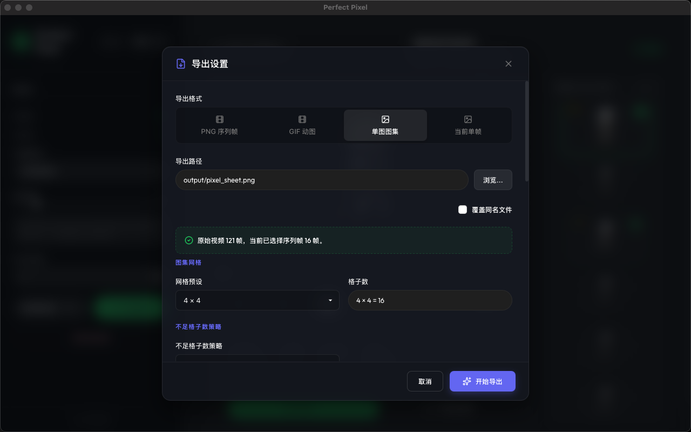
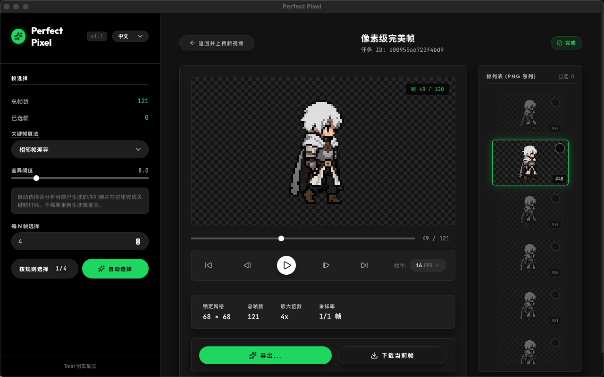
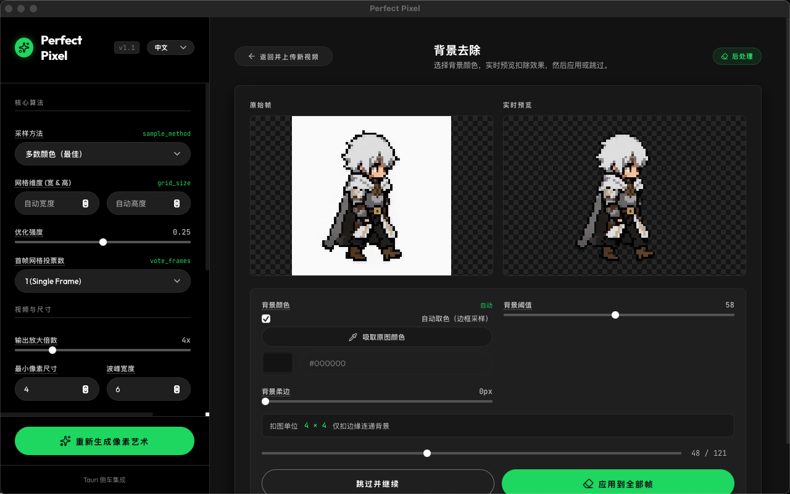

# Perfect Pixel Enhanced

> **Auto-detect, refine, and extract perfect pixel art from single frames and video sequences.**

[English](readme.md) | [简体中文](readme_zh.md)

[](#)
[](#)

---

## 🎬 Showcase

### 🖥️ Desktop Application Showcases
| 1. Main Interface & Video Processing | 2. Frame Range Selection | 3. Background Removal |
| :---: | :---: | :---: |
|  |  |  |

### 🎞️ Pixel & Sprite Sheet Export Demos
| Pixel Export Demo | Sprite Sheet Export Demo |
| :---: | :---: |
|  |  |

---

## 📌 Project Origin & Fork Information
This project is an enhanced **fork** of the original [theamusing/perfectPixel](https://github.com/theamusing/perfectPixel) repository. 

While the original tool was designed for refining single static pixel-style images, this enhanced fork extends the core grid refinement algorithm to support **video processing**, **temporal stability tuning**, **advanced post-processing (background removal & keyframe analysis)**, **batch exporting options**, and provides a **standalone, zero-dependency desktop application**.

---

## 🚀 Key Enhancements (This Fork)

### 1. Video Sequence & Temporal Stability Processing
- **Video to Pixel Art**: Extract, process, and refine MP4/MOV/AVI video frames into a pixel-perfect PNG sequence.
- **Auto-Grid Locking**: Detects the optimal pixel grid size on initial frames and locks it for the entire sequence to eliminate per-frame spatial jitter.
- **Vote Frames (`vote_frames`)**: Uses a multi-frame voting mechanism to establish the most stable coordinate grids.
- **Adaptive Grid & Temporal Smoothing**: Blends refined coordinates over time using exponential moving average (EMA) smoothing to ensure liquid-smooth movements without grid popping.
- **Denoising Preprocessing**: Filters compression artifacts on frames before grid estimation.

### 2. Advanced Post-Processing
- **Alpha-Preserving Background Removal**: Isolate characters and sprites from backgrounds using customizable parameters:
- `background_color`: Color to target (auto-detected or manually specified).
- `threshold`: Sensitivity of background matching.
- `feather`: Edge smoothing radius `[0, 8]` to blend pixel edges.
- `block_size`: Connectivity radius for background seeds.
- `edge_connected`: Restricts removal to edges to preserve internal pixels of matching colors.
- **Keyframe Analysis**: Automatically identify key animation frames using:
- **Adjacent Difference**: Compares consecutive frames to detect pixel changes.
- **Optical Flow**: Analyzes motion vectors between frames to identify key action states.

### 3. Custom Batch Exporting
Export processed sequences with full customizability:
- **Formats**: Supports `png_sequence`, `gif`, `sprite_sheet`, and `single_png`.
- **Custom Sprite Sheets**: Configure custom grid dimensions (`columns` x `rows`) and specify padding modes (`repeat_last` frame or leave trailing frames blank).
- **Target FPS & Loops**: Control playback rate and loop settings for exported GIFs and sequences.
- **Auto-Renaming**: Handles duplicate output paths intelligently to prevent accidental overwrites.

### 4. Standalone Desktop Client (Tauri + React + FastAPI)
- **Zero-Dependency Bundle**: Bundles the Python FastAPI processing server as an optimized, compiled `onedir` sidecar executable. Cold start times are reduced from **12.8s to ~0.3s**! No Python, Node, or Rust runtimes are needed by the end user.
- **Spotify-Inspired Immersive Dark UI**: A charcoal-black player interface with interactive settings, custom dropdowns, and settings panels.
- **Custom Scrollable Wheel Picker**: Replaced standard dropdowns with a smooth, tactile scroll-wheel picker for setting playback FPS and other values.
- **Interactive Range Selection**: Shift-click to select multiple frames in the sidebar, set loop playback over the selection, or export a customized subset of frames.
- **Inertial Timeline Scrolling**: Left settings panel and right-hand frame list feature custom momentum-based scroll physics with kinetic snapping.

---

## 📦 Installation

Perfect Pixel provides implementations with or without OpenCV. You can choose the one that fits your environment:

| Backend | File | Dependencies | Purpose |
| :--- | :--- | :--- | :--- |
| **OpenCV Backend** | [`perfect_pixel.py`](./src/perfect_pixel/perfect_pixel.py) | `opencv-python`, `numpy` | Default high-performance backend |
| **Lightweight Backend** | [`perfect_pixel_no_cv2.py`](./src/perfect_pixel/perfect_pixel_noCV2.py) | `numpy` | Lightweight backup (no cv2 required) |

Install the library via `pip`:
```bash
# Recommended: Fast version with OpenCV support
pip install perfect-pixel[opencv]

# Numpy version: Lightweight (NumPy only)
pip install perfect-pixel
```

---

## 🖥️ Desktop App Development

### 1. Prerequisite Setup (Python 3.11/3.12 recommended)
```bash
# Set up virtual environment and install backend requirements
python3.12 -m venv .venv && source .venv/bin/activate
pip install -r requirements.txt
```

### 2. Development Run
You can run the full desktop client with one command:
```bash
cd frontend
npm install
npm run tauri dev # Launches React frontend and auto-spawns FastAPI backend sidecar
```
The Tauri shell handles the lifecycle of the Python server (logging to `backend.log` and passing dynamic port bindings).

### 3. Build Distributable Package
To pack the app into a standalone double-clickable installer (`.dmg`/`.app` on macOS, `.exe` on Windows):
```bash
bash scripts/build_app.sh
```
This runs the PyInstaller sidecar builder first, copying target binaries under `frontend/src-tauri/binaries/`, and compiles the Tauri bundle.

#### Installing & First Launch (macOS)
The `.dmg` is a standard drag-and-drop installer: open it and drag **Perfect Pixel.app** into the **Applications** folder.

The release builds are **ad-hoc signed but not notarized** (no Apple Developer certificate), so on first launch macOS Gatekeeper will say it "cannot be verified." To open it:
- **Right-click** the app → **Open** → **Open anyway**; or
- Run `xattr -dr com.apple.quarantine "/Applications/Perfect Pixel.app"` in Terminal (removes the download quarantine flag).

---

## 🔌 ComfyUI Custom Node
A custom node integration is available to run Perfect Pixel directly inside ComfyUI:
- [`Learn how to use Perfect Pixel as a ComfyUI node`](integrations/comfyui/README.md)

---

## 🛠️ API & CLI Usage

### Static Image Refinement
```python
import cv2
from perfect_pixel import get_perfect_pixel

bgr = cv2.imread("images/avatar.png", cv2.IMREAD_COLOR)
rgb = cv2.cvtColor(bgr, cv2.COLOR_BGR2RGB)

# Refine grid and sample
w, h, out = get_perfect_pixel(rgb)
```

### Video API Quick Test
```bash
# Submit video job (temporal stability defaults to on)
curl -F video=@test.mp4 -F output_scale=4 http://127.0.0.1:8765/api/jobs
# Poll job status
curl http://127.0.0.1:8765/api/jobs/<job_id>
```

For more endpoints and parameter specifications, see [`docs/API.md`](./docs/API.md).

---

## ⚙️ REST API Endpoints Overview

#### 1. Submit Video Job (`POST /api/jobs`)
Submit a video file for processing with temporal stability parameters:
- `adaptive_grid`: (`true/false`) Blend grid coordinates across frames.
- `grid_blend`: (`0.0 - 1.0`) EMA weight for grid lines.
- `temporal_smoothing`: (`true/false`) EMA color smoothing.
- `temporal_alpha`: (`0.0 - 1.0`) Color smoothing factor.
- `scene_change_threshold`: Threshold to bypass smoothing on scene cuts.
- `vote_frames`: Number of initial frames to vote on optimal grid dimensions.
- `denoise`: (`true/false`) Enable edge-preserving denoising.

#### 2. Keyframe Analysis (`POST /api/jobs/{job_id}/keyframes`)
Detect key transition frames on processed sequences:
- `threshold`: Delta value for detecting key changes.
- `method`: (`adjacent` | `flow`) Keyframe detection algorithm.

#### 3. Background Removal (`POST /api/jobs/{job_id}/background-removal`)
Batch remove backgrounds from processed frames:
- `background_color`: Target color (hex/RGB) or auto-detect.
- `threshold`: Extraction tolerance.
- `feather`: Edge blur radius.
- `edge_connected`: (`true/false`) Only remove regions connected to boundaries.

#### 4. Export Job (`POST /api/jobs/{job_id}/exports`)
Export frames in various custom formats:
- `format`: (`png_sequence` | `gif` | `sprite_sheet` | `single_png`).
- `frame_selection`: Specific frame ranges or indices to export.
- `size`: Output scale settings.
- `sprite_columns` / `sprite_rows`: Dimensions for custom sprite sheets.

---

## 🧮 Algorithm Overview
The core algorithm runs in three primary stages:
1. **Grid Detection**: Estimates optimal grid spacing from the Fast Fourier Transform (FFT) magnitude of the image luminance.
2. **Coordinate Refinement**: Performs 1D search on Sobel edges to align coordinate lines exactly to pixel boundaries.
3. **Resampling**: Samples the source pixels at aligned grid centers to output clean, crisp, pixel-perfect illustrations.

---

## 📄 License
This project is released under the **MIT License** — see [`LICENSE`](./LICENSE).
