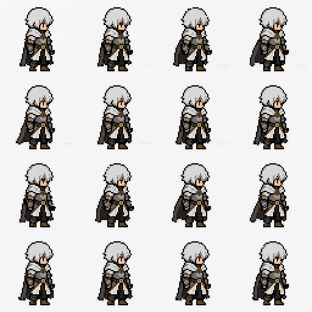

# Perfect Pixel Enhanced (像素级完美帧增强版)

> **自动检测、精细化并获取单帧图像及视频序列的完美像素艺术。**

[English](readme.md) | [简体中文](readme_zh.md)

[](#)
[](#)

---

## 📌 项目起源与 Fork 说明
本项目是原始 [theamusing/perfectPixel](https://github.com/theamusing/perfectPixel) 仓库的增强型 **Fork** 版本。

原项目主要用于处理单张静态像素图的网格对齐，而本增强版本在此基础上，扩展了对**视频时序处理**和**时序稳定性调优**的支持，引入了**高级后处理（去背景与关键帧分析）**、**深度自定义批量导出**，并提供了一个**独立运行、零依赖的跨平台桌面端应用**。

---

## 🚀 核心新增特性 (本 Fork)

### 1. 视频序列与时序稳定性处理
- **视频像素化转换**：支持提取并精细化 MP4/MOV/AVI 视频帧，最终输出完美对齐网格的像素 PNG 帧序列。
- **自动网格锁定**：在起始帧上自动检测最佳像素网格尺寸，并在后续帧中予以锁定，杜绝因每帧独立估计而导致的空间网格抖动。
- **首帧网格投票数 (`vote_frames`)**：基于多帧投票机制计算起始坐标网格，确保检测到的网格基础极其稳固。
- **自适应网格与时序平滑**：通过指数移动平均 (EMA) 在时序上平滑混合优化后的坐标，确保画面运动如丝般顺滑，无网格突变 popping。
- **去噪预处理**：在进行网格估算前，过滤视频帧中的压缩伪影。

### 2. 高级后处理功能
- **保留透明度的背景去除**：利用可自定义的参数将角色/精灵从背景中剥离：
  - `background_color`：目标背景颜色（支持自动检测或手动指定）。
  - `threshold`：背景匹配的容差/敏感度。
  - `feather`：边缘羽化半径 `[0, 8]`，平滑过渡像素边缘。
  - `block_size`：去背景种子的连通半径。
  - `edge_connected`：仅限制从图像边缘向内清除，以保留内部同色像素。
- **关键帧分析**：自动识别动画序列中的关键过渡帧：
  - **相邻差值法 (Adjacent Difference)**：比较相邻帧的像素差异来检测动作变化。
  - **光流法 (Optical Flow)**：分析帧间运动矢量以捕获核心动作帧。

### 3. 自定义批量导出
支持多种格式的精细化批量导出：
- **支持格式**：`png_sequence`（PNG 序列）、`gif`、`sprite_sheet`（雪碧图/精灵表）和 `single_png`（单帧）。
- **自定义雪碧图网格**：自由设定行列数（`columns` x `rows`），并支持在空白格子中选择填充模式（`repeat_last` 循环最后一帧或留空）。
- **帧率与循环控制**：为导出的 GIF/动画序列配置目标 FPS 及循环播放。
- **自动重命名**：智能检测同名输出路径，防止因重复导出导致文件被意外覆盖。

### 4. 独立运行的桌面客户端 (Tauri + React + FastAPI)
- **零依赖打包**：将 Python FastAPI 后端服务编译为优化后的 `onedir` 格式 sidecar 直接打包进客户端。冷启动时间由原来的 **12.8秒大幅缩短至约0.3秒**！用户无需安装 Python、Node 或 Rust 运行环境，双击即可直接运行。
- **Spotify 风格的沉浸式暗黑 UI**：高阶质感的纯黑/炭灰界面，集成各类交互式微调开关与美化面板。
- **自定义滚动轮播选择器 (Wheel Picker)**：用平滑且具实体手感的滚动滑轮取代了常规下拉菜单，用于调节播放 FPS 等参数。
- **交互式帧范围选择**：支持在右侧侧边栏通过 `Shift + 点击` 批量选中多帧进行循环试播，或仅导出所选帧。
- **带惯性的阻尼时间轴**：左侧设置面板与右侧帧列表均支持带惯性的平滑阻尼滚动和中心磁吸贴合效果。

---

## 🎬 效果展示

### 像素化及导出效果


### 精灵表 (Sprite Sheet) 导出效果


---

## 📦 安装与配置

本库提供了包含 OpenCV 和无 OpenCV（轻量级）两种实现方案。您可以根据环境选择：

| 后端 | 文件 | 依赖 | 用途说明 |
| :--- | :--- | :--- | :--- |
| **OpenCV 后端** | [`perfect_pixel.py`](./src/perfect_pixel/perfect_pixel.py) | `opencv-python`, `numpy` | 默认的高性能推荐后端 |
| **轻量级后端** | [`perfect_pixel_no_cv2.py`](./src/perfect_pixel/perfect_pixel_noCV2.py) | `numpy` | 纯 NumPy 实现（无需安装 cv2） |

使用 `pip` 安装库：
```bash
# 推荐：支持 OpenCV 的快速版本
pip install perfect-pixel[opencv]

# NumPy 轻量版：无 OpenCV 依赖
pip install perfect-pixel
```

---

## 🖥️ 桌面端应用开发

### 1. 准备工作 (推荐使用 Python 3.11/3.12)
```bash
# 创建虚拟环境并安装后端依赖
python3.12 -m venv .venv && source .venv/bin/activate
pip install -r requirements.txt
```

### 2. 开发环境启动
您可以通过一条命令同时启动前端 UI 和后端 sidecar 服务：
```bash
cd frontend
npm install
npm run tauri dev # 启动 React 前端并自动唤起 FastAPI 后端进程
```
Tauri 外壳会自动管理 Python 后端的生命周期（日志输出至 `backend.log` 并动态绑定空闲端口）。

### 3. 构建发布包
将应用打包为独立双击安装包（macOS 下为 `.dmg`/`.app`，Windows 下为 `.exe`）：
```bash
bash scripts/build_app.sh
```
该脚本会首先通过 PyInstaller 编译后端 sidecar 可执行程序并拷贝至 `frontend/src-tauri/binaries/`，随后执行 Tauri 打包。

#### 安装与首次打开（macOS）
`.dmg` 是标准的拖拽式安装包：打开后把 **Perfect Pixel.app** 拖入 **Applications** 文件夹快捷方式即可。

Release 构建为 **ad-hoc 签名但未公证**（无 Apple Developer 证书），首次打开 macOS 会提示"无法验证开发者"。打开方式：
- **右键点击** App → **打开** → **仍要打开**；或者
- 在终端执行 `xattr -dr com.apple.quarantine "/Applications/Perfect Pixel.app"`（移除下载隔离标志）。

---

## 🔌 ComfyUI 自定义节点
我们提供了 ComfyUI 自定义节点，以便直接在 ComfyUI 工作流中使用：
- [`了解如何将 Perfect Pixel 用作 ComfyUI 节点`](integrations/comfyui/README.md)

---

## 🛠️ API 与命令行使用

### 静态图像网格优化
```python
import cv2
from perfect_pixel import get_perfect_pixel

bgr = cv2.imread("images/avatar.png", cv2.IMREAD_COLOR)
rgb = cv2.cvtColor(bgr, cv2.COLOR_BGR2RGB)

# 估算网格并采样生成完美像素图
w, h, out = get_perfect_pixel(rgb)
```

### 视频处理接口快捷测试
```bash
# 提交视频任务（时序稳定性默认开启）
curl -F video=@test.mp4 -F output_scale=4 http://127.0.0.1:8765/api/jobs
# 查询任务状态
curl http://127.0.0.1:8765/api/jobs/<job_id>
```

完整的接口设计、参数负载以及 sidecar 集成模式请参考接口协议文档 [`docs/API.md`](./docs/API.md)。

---

## ⚙️ REST API 主要端点说明

#### 1. 提交视频任务 (`POST /api/jobs`)
提交视频文件进行像素化处理，支持以下稳定性参数：
- `adaptive_grid`: (`true/false`) 是否在帧间平滑混合网格线坐标。
- `grid_blend`: (`0.0 - 1.0`) 网格 EMA 混合权重。
- `temporal_smoothing`: (`true/false`) 是否启用像素颜色 EMA 平滑。
- `temporal_alpha`: (`0.0 - 1.0`) 颜色平滑权重。
- `scene_change_threshold`: 场景切换阈值，超出该值则直通，不作平滑。
- `vote_frames`: 用前 N 帧的中位数投票决定最佳网格基础尺寸。
- `denoise`: (`true/false`) 是否开启去压缩伪影的保边降噪。

#### 2. 关键帧分析 (`POST /api/jobs/{job_id}/keyframes`)
检测序列中的关键过渡动作帧：
- `threshold`: 检测变化的阈值灵敏度。
- `method`: (`adjacent` | `flow`) 关键帧检测算法（相邻帧差异法或光流法）。

#### 3. 背景去除 (`POST /api/jobs/{job_id}/background-removal`)
批量剔除像素帧背景，保留透明度：
- `background_color`: 目标背景色或自动检测。
- `threshold`: 背景提取容差。
- `feather`: 边缘羽化模糊半径。
- `edge_connected`: (`true/false`) 是否仅从边缘向内连通清除背景。

#### 4. 导出任务 (`POST /api/jobs/{job_id}/exports`)
按指定格式打包导出：
- `format`: 支持 `png_sequence`、`gif`、`sprite_sheet` 和 `single_png`。
- `frame_selection`: 自定义导出的帧索引或范围。
- `size`: 目标输出倍率或尺寸。
- `sprite_columns` / `sprite_rows`: 自定义雪碧图导出的网格行列数。

---

## 🧮 算法原理概述
核心算法包含以下三个主要步骤：
1. **网格大小估算**：通过对图像亮度进行快速傅里叶变换 (FFT)，分析频域幅度来估算最佳网格尺寸并生成基础网格。
2. **网格坐标精细化**：在 Sobel 边缘图像上执行一维搜索，微调网格坐标使其精确对齐边缘边界。
3. **像素重采样**：在微调后的网格中心提取原始像素颜色，重新渲染为规整、锐利的完美像素艺术画。

---

## 📄 开源协议
本项目采用 **MIT License** 授权协议发布，详见 [`LICENSE`](./LICENSE)。
